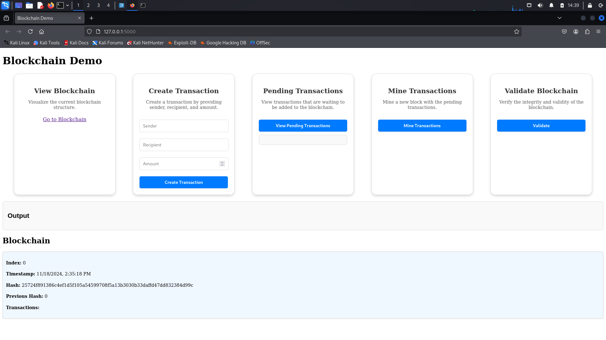
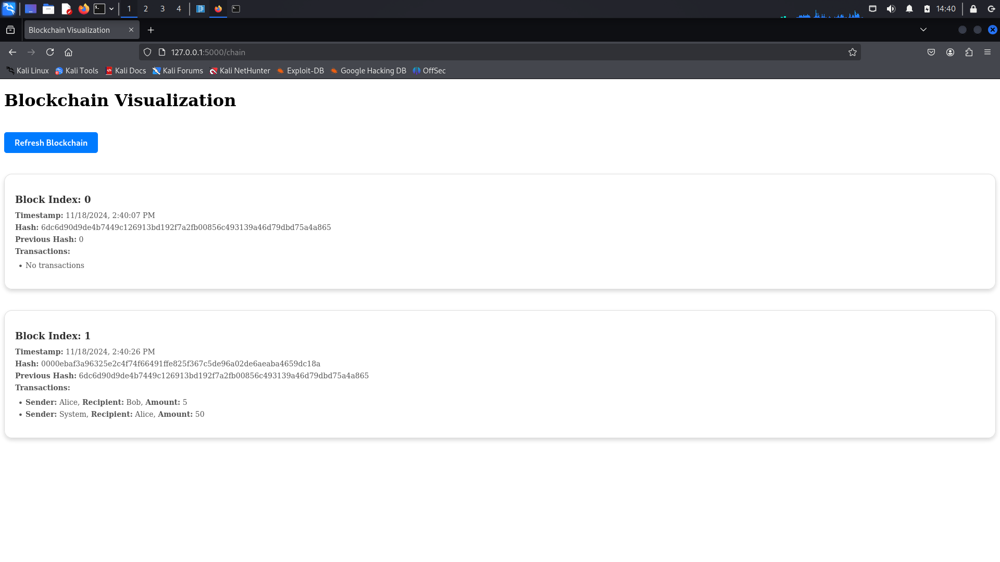

# **Blockchain Demo Application**

## **Overview**

This is a **Blockchain Demo Application** implemented in Python with a web-based user interface. It provides a simple simulation of blockchain functionality, including the creation of transactions, mining blocks, and verifying the blockchain's integrity. The project demonstrates the fundamental concepts of blockchain technology, including cryptographic signatures, block hashing, and chain validation.

---

## **Features**

The application includes the following key features:

### **1. Transaction Management**
- **Create Transactions**: Users can create transactions by specifying the sender, recipient, and amount.
- **Pending Transactions**: View all transactions waiting to be added to the blockchain.

### **2. Mining**
- **Mine Pending Transactions**: Users can mine a new block containing the pending transactions. Mining rewards are automatically added to the miner's address.

### **3. Blockchain Visualization**
- **View Blockchain**: Explore the current blockchain structure, including each block's:
  - Index
  - Timestamp
  - Hash
  - Previous hash
  - Transactions within the block

### **4. Validation**
- **Validate Blockchain**: Verify the blockchain's integrity by checking the hashes and chain links. Any tampering or corruption will be detected.

---

## **Screenshots**

### **Main Page**


### **Blockchain Visualization**


---

## **Technologies Used**

### **Backend**
- **Python**: Core logic of the blockchain.
- **Flask**: Web framework for building the REST API and serving HTML.
- **Cryptography**: Used for generating and verifying cryptographic signatures.

### **Frontend**
- **HTML, CSS, JavaScript**: User interface design.
- **D3.js**: For visualizing the blockchain structure.

### **Other**
- **Docker**: The application is containerized for easy deployment.

---

## **Project Structure**

```plaintext
.
├── app
│   ├── blockchain.py         # Blockchain logic
│   ├── transaction.py        # Transaction handling
│   ├── routes.py             # API routes and page rendering
│   ├── utils.py              # Utility functions
│   └── __init__.py           # Flask app initialization
├── static
│   ├── index.js              # Main JavaScript logic
│   ├── chain.js              # Blockchain visualization logic
│   ├── styles.css            # CSS styles
│   └── scripts.js            # Additional helper scripts
├── templates
│   ├── index.html            # Main page template
│   ├── chain.html            # Blockchain visualization template
├── requirements.txt          # Python dependencies
├── run.py                    # Main application entry point
├── Dockerfile                # Docker configuration
└── README.md                 # Documentation
```

---

## **Installation and Usage**

### **Requirements**
- **Docker** (for containerized deployment)
- Alternatively:
  - **Python 3.9+**
  - Virtual environment tools such as `venv` or `virtualenv`

### **Setup**

#### **Using start.sh**
1. Set the privilege
  ```bash
  chmod +x start.sh
  ```

2. Run the script
  ```bash
  ./start.sh
  ```
  
#### **Using Docker**
1. Clone the repository:
   ```bash
   git clone https://github.com/your-username/blockchain-demo.git
   cd blockchain-demo
   ```

2. Build the Docker image:
   ```bash
   docker build -t blockchain-demo .
   ```

3. Run the Docker container:
   ```bash
   docker run --rm -d -p 5000:5000 --network host --name blockchain-demo blockchain-demo
   ```

4. Access the application in your browser:
   ```
   http://127.0.0.1:5000
   ```

#### **Without Docker**
1. Clone the repository:
   ```bash
   git clone https://github.com/your-username/blockchain-demo.git
   cd blockchain-demo
   ```

2. Create and activate a virtual environment:
   ```bash
   python3 -m venv venv
   source venv/bin/activate  # For Linux/Mac
   venv\Scriptsctivate     # For Windows
   ```

3. Install dependencies:
   ```bash
   pip install -r requirements.txt
   ```

4. Run the application:
   ```bash
   python run.py
   ```

5. Access the application in your browser:
   ```
   http://127.0.0.1:5000
   ```

---

## **API Endpoints**

### **Transaction Endpoints**
- `POST /api/create_transaction`
  - **Description**: Create a new transaction.
  - **Request Body**:
    ```json
    {
      "sender": "Alice",
      "recipient": "Bob",
      "amount": 10
    }
    ```
- `GET /api/pending_transactions`
  - **Description**: Retrieve all pending transactions.

### **Mining Endpoints**
- `POST /api/mine`
  - **Description**: Mine a block with the pending transactions.
  - **Request Body**:
    ```json
    {
      "miner": "MinerAddress"
    }
    ```

### **Blockchain Endpoints**
- `GET /api/chain`
  - **Description**: Retrieve the entire blockchain.
- `GET /api/validate`
  - **Description**: Validate the blockchain's integrity.

---

## **Key Functional Details**

### **1. Transactions**
Each transaction includes:
- **Sender**
- **Recipient**
- **Amount**
- **Signature** (if applicable)

System transactions (e.g., mining rewards) do not require a signature.

### **2. Mining**
When mining:
- A reward transaction is added to the pending transactions.
- The miner receives the reward in the next block.

### **3. Blockchain Validation**
Validation checks:
- The hash of each block is correctly calculated.
- Each block's `previous_hash` matches the hash of the previous block.

---

## **Customization**

### **Difficulty Adjustment**
You can change the mining difficulty in `blockchain.py`:
```python
self.difficulty = 4  # Increase for more computation time
```

### **Mining Reward**
Change the reward amount in `blockchain.py`:
```python
self.mining_reward = 50  # Adjust as needed
```

---

## **Future Improvements**
- Add support for multiple wallets and dynamic key generation.
- Improve transaction visualization with more detailed information.
- Implement peer-to-peer networking for blockchain replication.
- Optimize mining for better performance in larger blockchains.

---

## **License**
This project is licensed under the MIT License. Feel free to use and modify it as needed.

---

## **Contributors**
- [Scen4ri0](https://github.com/Scen4ri0)

For any questions or issues, feel free to open an issue on GitHub or reach out via email. 😊
